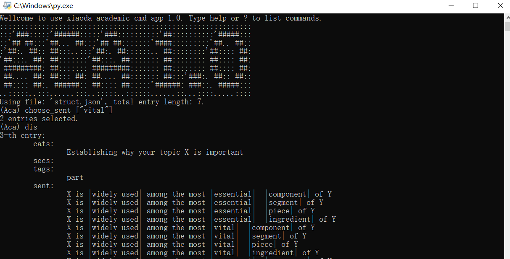

# In Memory of

My grandma (mother's mother). She passed away in 2010. She raised me when I was a kid. In my memory, she was a little bit lonely. She didn't get along with her son. They didn't talk to each other for years even they lived in the same house, but in separate rooms, the door between witch was deliberately blocked. She died of heart attack alone in her bed with no one noticed, until a few days later her neighbor came by.   She cried her heart out when her daughter died, but not so much when her husband died. But she was always happy with me around.

# Current Functionality

- Inter active cmd using [python cmd](https://docs.python.org/3/library/cmd.html).
- Academic sentences referred from [this repository](https://github.com/nashamri/academic-phrases/blob/master/academic-phrases.el)

- `add`, `remove`,`update` entries in json data.
- `choose_cats`,`choose_secs`,`choose_tags`,`choose_sent`  to select entries.
- `dis`,`dis_cats`, `dis_tags` to display currently active data, categories, and tags.

# Future Functionality

- synonyms using [Datamuse](https://www.datamuse.com/api/)
- input more sentences in order to enrich expression.

